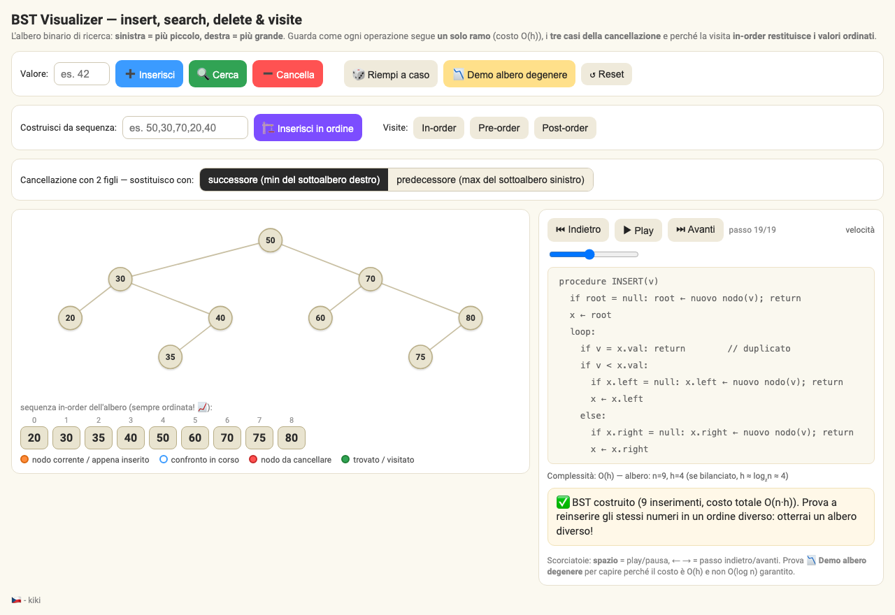
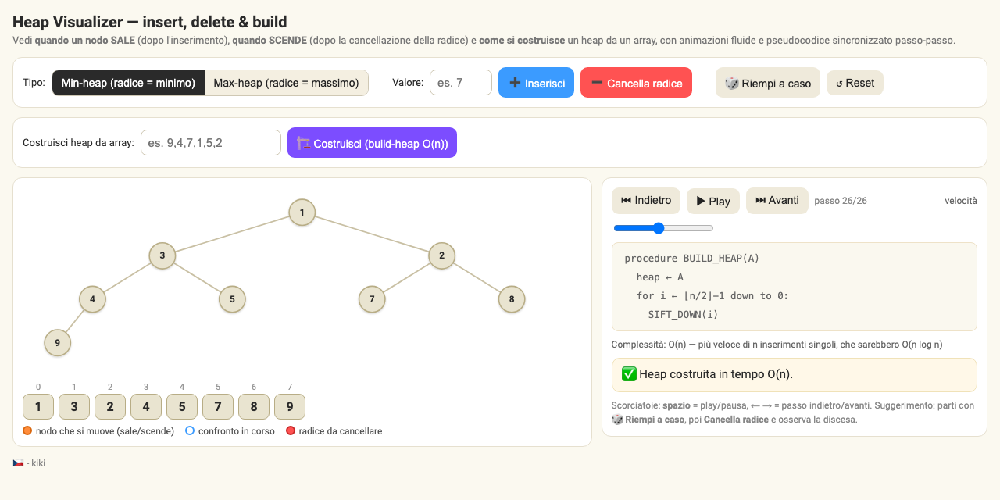
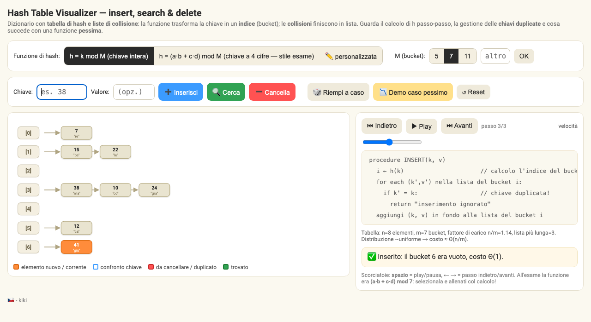

<div align="center">

# Appunti di Informatica

**Corso di Laurea Triennale in Informatica (11896) — Università di Genova**

[](LICENSE)
[](https://github.com/kikienrico/UniGE-11896/commits/main)
[](https://github.com/kikienrico/UniGE-11896/actions)

[Corsi](#corsi) · [Simulatori interattivi](#simulatori-interattivi) · [Organizzazione](#come-sono-organizzati-gli-appunti) · [Contribuire](#contribuire)

</div>

---

Appunti, riassunti e strumenti di studio presi lezione per lezione durante il percorso di laurea. Tutto è scritto in **Obsidian** (o su carta e poi trascritto), organizzato per corso e aggiornato man mano che le lezioni avanzano.

Il repository non è una raccolta di dispense ufficiali: è il materiale con cui studio davvero, condiviso nella speranza che sia utile anche a te.

## Corsi

### Primo anno — primo semestre

| Corso | Codice | Materiale |
|---|---|---|
| [Architettura dei Calcolatori](./67425%20Architettura%20dei%20Calcolatori) | 67425 | Appunti per lezione (markdown + versioni riordinate) |
| [Algebra](./73027%20Algebra) | 73027 | Appunti per lezione |
| [Logica](./73029%20Logica) | 73029 | Appunti per lezione |
| [Introduzione alla Programmazione](./80299%20Introduzione%20alla%20Programmazione) | 80299 | Appunti per lezione |
| [Laboratorio di IP](./Laboratorio%20IP) | 80299 | Esercizi C++ svolti, archiviati per data |

### Primo anno — secondo semestre

| Corso | Codice | Materiale |
|---|---|---|
| [Calculus 1](./57069%20Calculus%201) | 57069 | Appunti per lezione (PDF) |
| [Algoritmi e Strutture Dati](./80298%20Algoritmi%20e%20Strutture%20Dati) | 80298 | Appunti per lezione, riassunto per l'esame scritto, simulatori interattivi |

## Simulatori interattivi

Tre visualizzatori per esercitarsi con le strutture dati di ASD, ognuno in un singolo file HTML senza dipendenze. **Si aprono direttamente nel browser**, senza scaricare né installare nulla:

| Simulatore | Operazioni supportate | |
|---|---|---|
| **Binary Search Tree** | insert, search, delete e visite (pre/in/post-order) | [Apri nel browser →](https://kikienrico.github.io/UniGE-11896/80298%20Algoritmi%20e%20Strutture%20Dati/Simulatori/bst_visualizer.html) |
| **Heap (min/max)** | insert e delete con heapify passo-passo | [Apri nel browser →](https://kikienrico.github.io/UniGE-11896/80298%20Algoritmi%20e%20Strutture%20Dati/Simulatori/heap_visualizer.html) |
| **Hash Table** | insert, search, delete con liste di collisione | [Apri nel browser →](https://kikienrico.github.io/UniGE-11896/80298%20Algoritmi%20e%20Strutture%20Dati/Simulatori/hash_visualizer.html) |

Ogni simulatore mostra la struttura graficamente e permette di eseguire le operazioni una alla volta, per capire *cosa succede* a ogni passo — lo stesso ragionamento richiesto negli esercizi d'esame.

<div align="center">
<a href="https://kikienrico.github.io/UniGE-11896/80298%20Algoritmi%20e%20Strutture%20Dati/Simulatori/bst_visualizer.html">

</a>
<br>
<sub>Il BST Visualizer in azione</sub>
<br><br>
<a href="https://kikienrico.github.io/UniGE-11896/80298%20Algoritmi%20e%20Strutture%20Dati/Simulatori/heap_visualizer.html">

</a>
<a href="https://kikienrico.github.io/UniGE-11896/80298%20Algoritmi%20e%20Strutture%20Dati/Simulatori/hash_visualizer.html">

</a>
<br>
<sub>Heap e Hash Table Visualizer — clicca un'immagine per provare il simulatore</sub>
</div>

## Come sono organizzati gli appunti

Di ogni lezione esistono, solitamente, tre versioni:

| Versione | File | Cos'è |
|---|---|---|
| Originale | `YYYY-MM-DD.md` | Gli appunti così come presi a lezione |
| Riordinata | `YYYY-MM-DD LLM.md` | Gli stessi appunti riorganizzati con l'aiuto di un'AI per essere leggibili anche da terzi |
| PDF | `YYYY-MM-DD.pdf` | Esportazione pronta per la stampa |

> **Nota sulla versione riordinata:** l'AI non aggiunge alcuna informazione. Il contenuto è esattamente quello preso a lezione, solo riordinato e formattato quando gli appunti originali sono frettolosi o disordinati.

## Struttura del repository

```
├── 57069 Calculus 1/                  Appunti PDF per lezione
├── 67425 Architettura dei Calcolatori/
├── 73027 Algebra/
├── 73029 Logica/
├── 80298 Algoritmi e Strutture Dati/
│   ├── Appunti presi a lezione/
│   ├── Appunti per studio esame/      Riassunto esteso per lo scritto
│   └── Simulatori/                    BST, Heap e Hash Table interattivi
├── 80299 Introduzione alla Programmazione/
├── Laboratorio IP/
│   ├── Latest/                        Gli esercizi più recenti
│   ├── 07-10-2025/ …                  Esercizi archiviati per data di inizio
│   └── Esercizi Teoria/
├── Riferimenti Utili/                 Cheat sheet: LaTeX, Vim, RISC-V, …
└── Code/                              Snippet C++ vari
```

Gli esercizi del **Laboratorio IP** seguono una regola semplice: la cartella `Latest` contiene sempre i più recenti; quando ne escono di nuovi, i precedenti vengono archiviati in una cartella con la data di inizio svolgimento.

## Contribuire

Hai trovato un errore, un refuso o vuoi aggiungere qualcosa? Ogni contributo è benvenuto:

- **[Apri una Issue](https://github.com/kikienrico/UniGE-11896/issues)** per segnalare errori o proporre miglioramenti
- **Apri una Pull Request** se vuoi correggere o integrare direttamente il materiale

## Licenza

Distribuito con licenza [MIT](LICENSE). Sei libero di usare, copiare e ridistribuire il materiale — una citazione è gradita ma non obbligatoria.

<div align="center">
<sub>Scritto con cura (e un po' di caffè) durante le lezioni · UniGE 2025 →</sub>
</div>
